# Max Signal Plotter

This is a max patch that I load in a bpatcher object. It is a result of too many hours trying to learn gen~ while reading Graham Wakefield's & Gregory Taylor's GENERATING SOUND & ORGANIZING TIME book. At first it was just a plot~ object that I could change the y range at ease, then I just added more features. Perhaps too much.

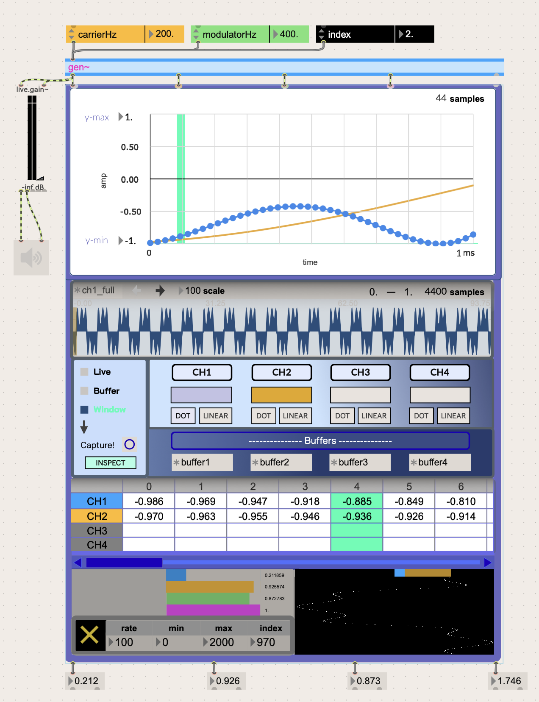

## UPDATE:

This tool now has new features:

- 4 Channels
- 3 Different Modes: Sample Window Capture, Buffers, and Live Audio
- Inspecting a single point in a 44 window capture and seeing them in a cell block.

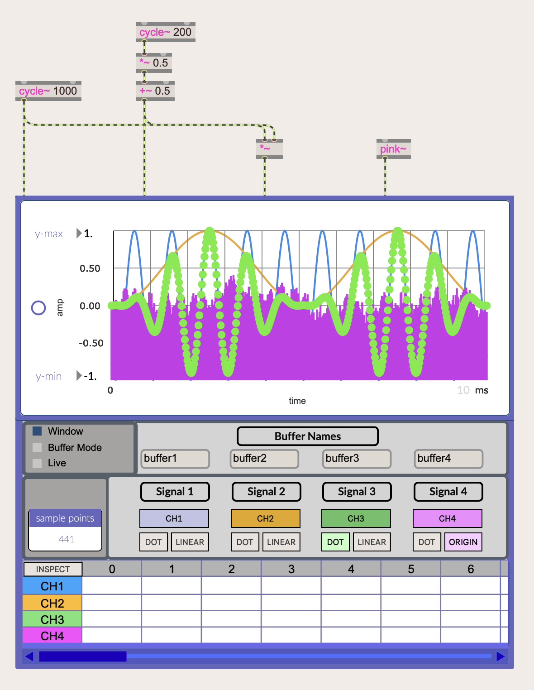
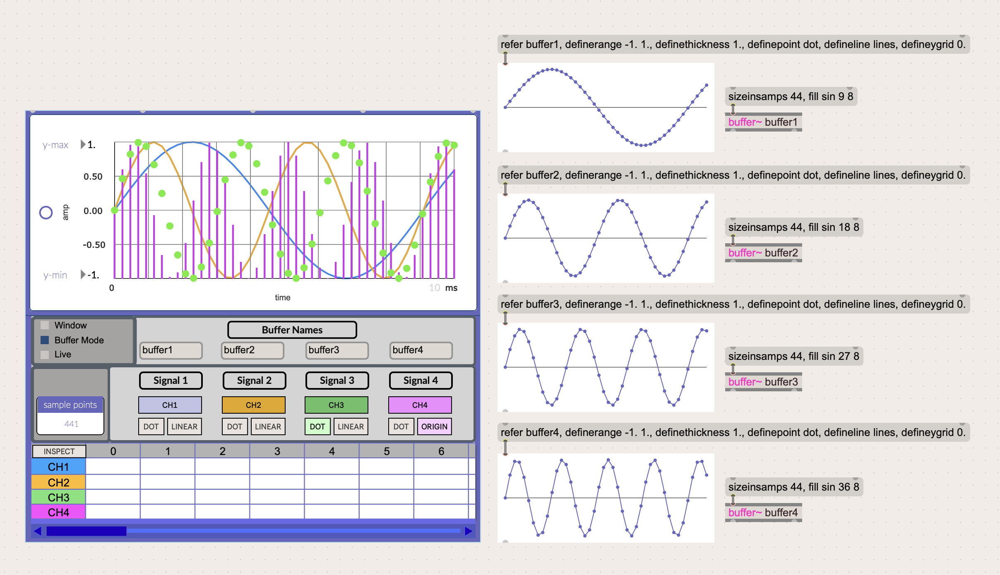
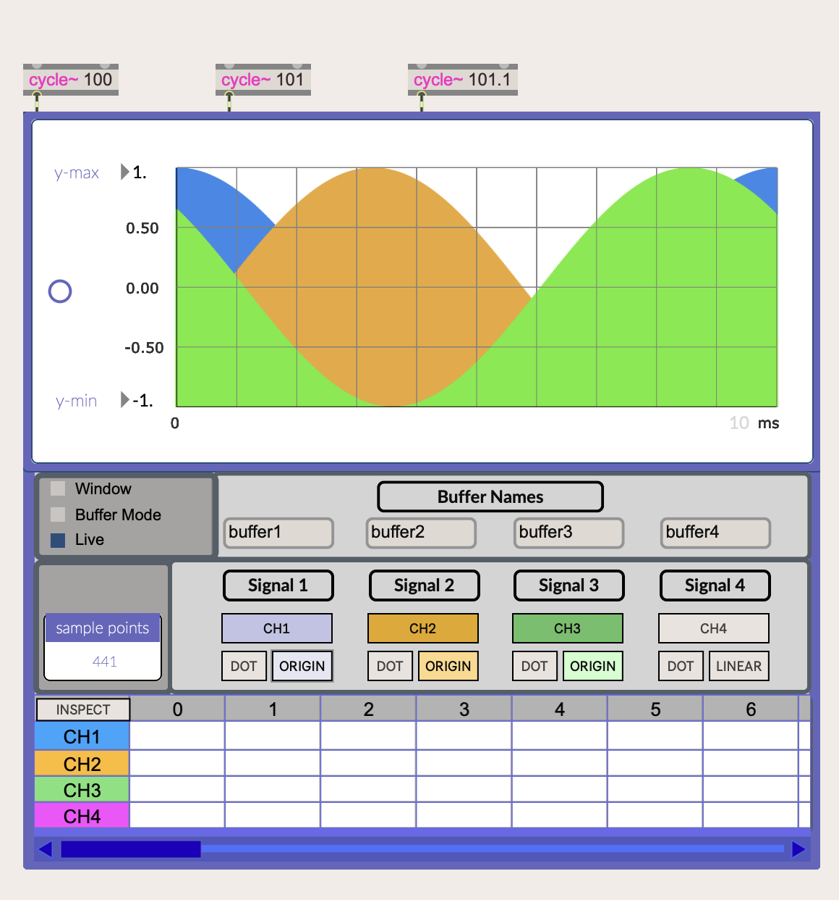
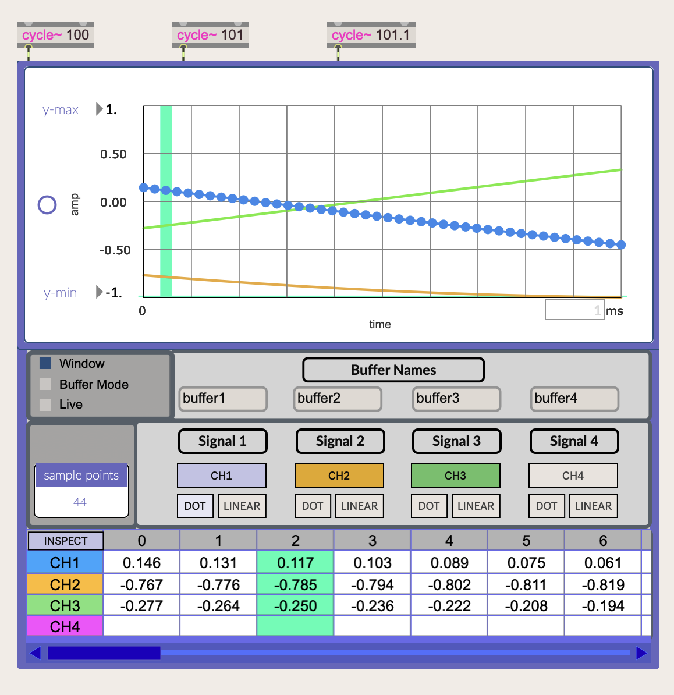

This works similarly to SuperCollider's .poll() function which polls a signal sample by sample after it is called.

You can use this to analyze a snapshot of a signal.

You can:
  - Specify the amount of milliseconds that you want to plot.
  - Specify the y-axis values.
  - ~Compare two channels.~ (**Now 4!**)
  - Change the line and point type of the plot~ object.
  - ~Show signal vector borders.~ (Removed this features until I can justify its use)

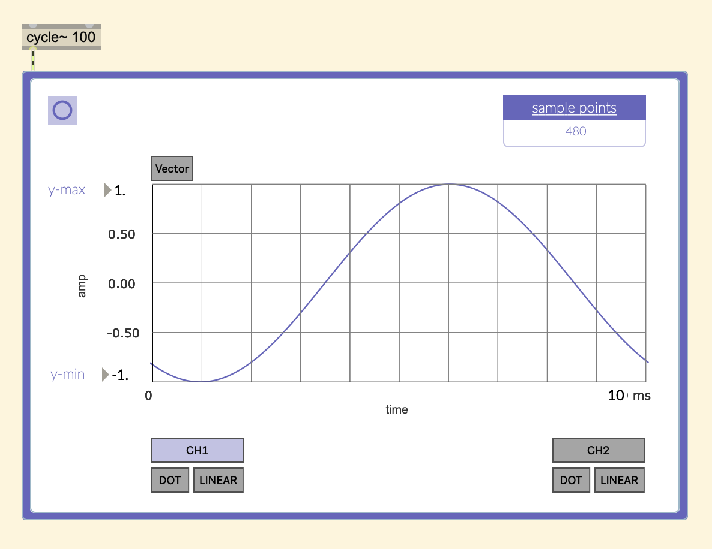
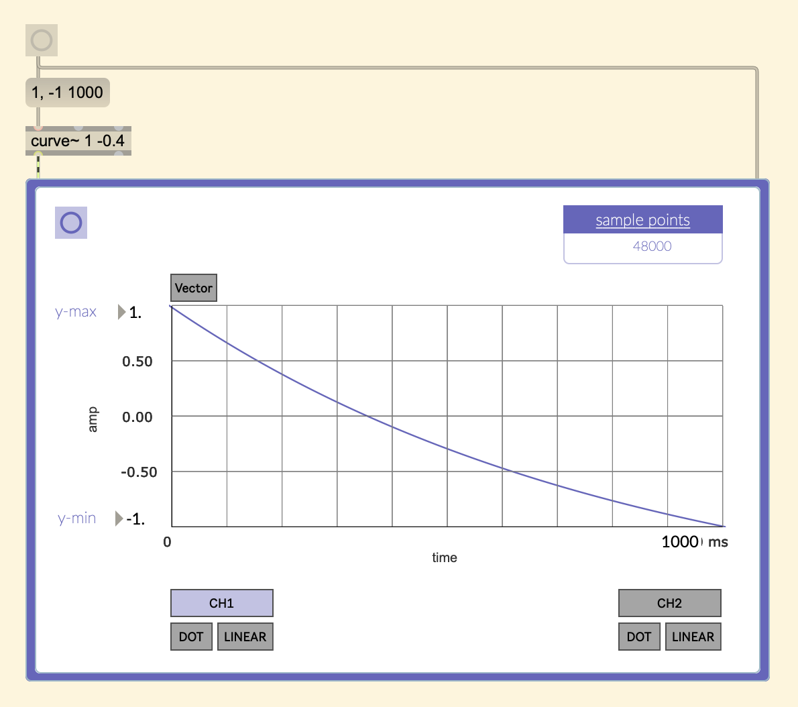
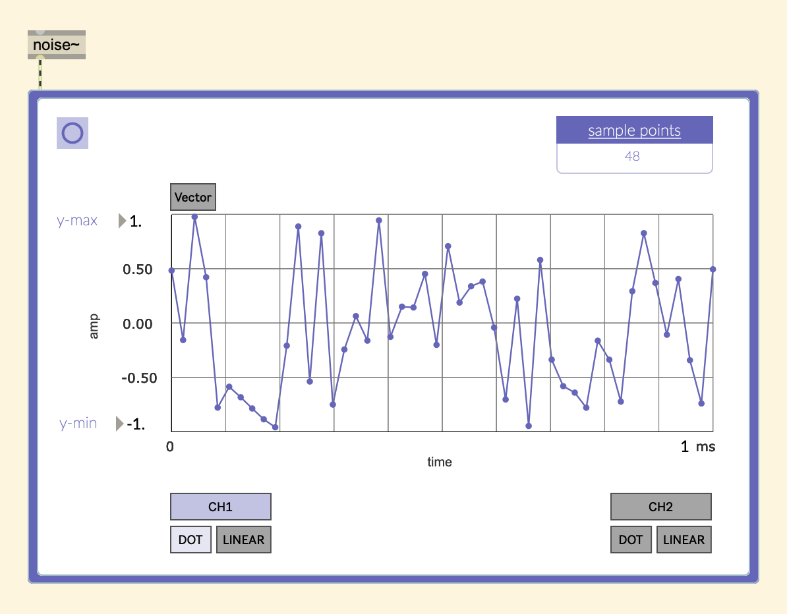
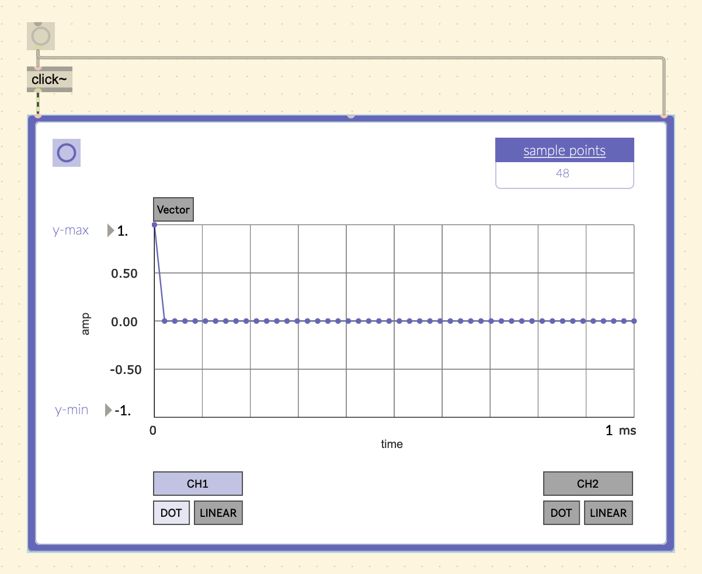
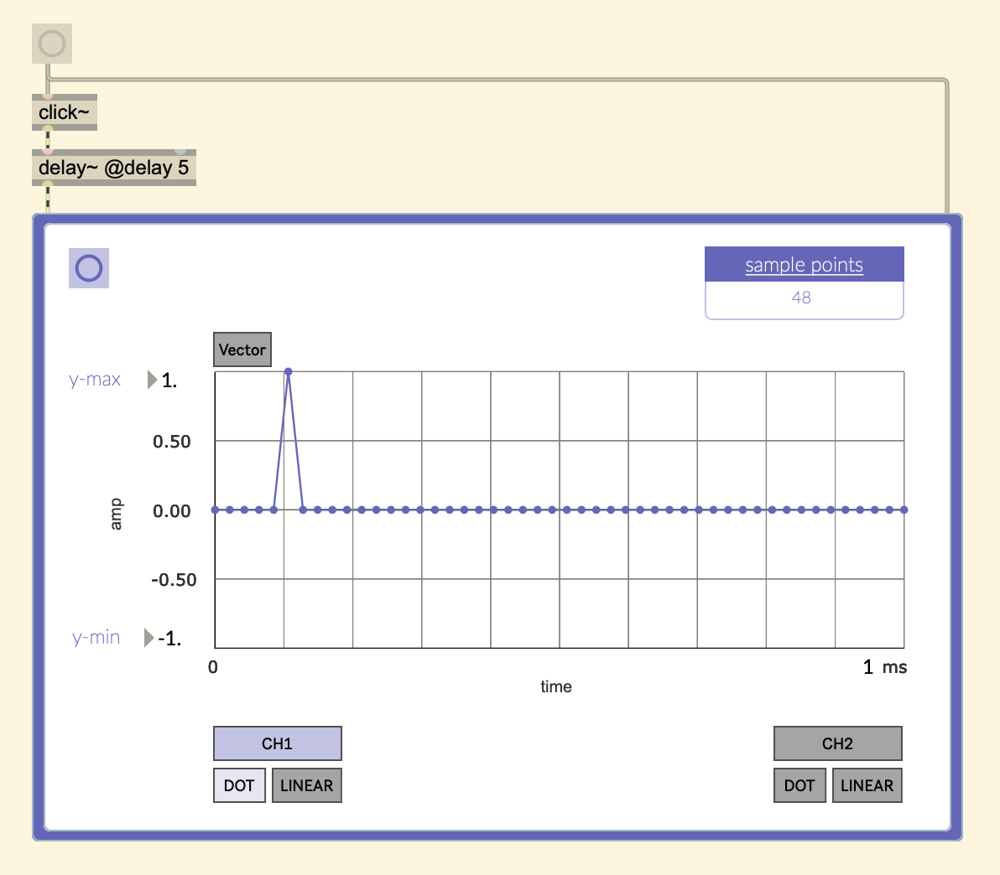
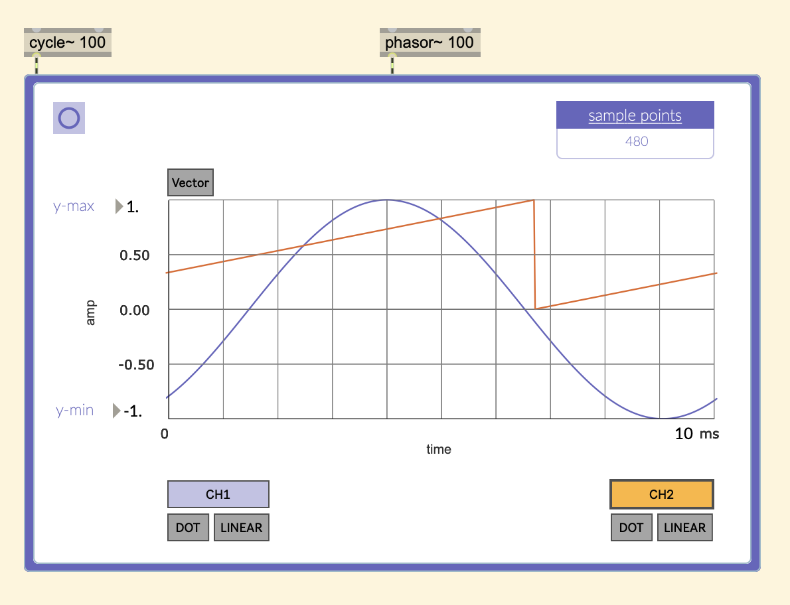

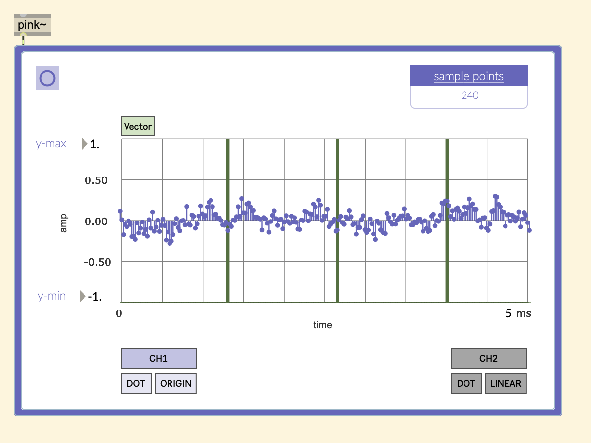
