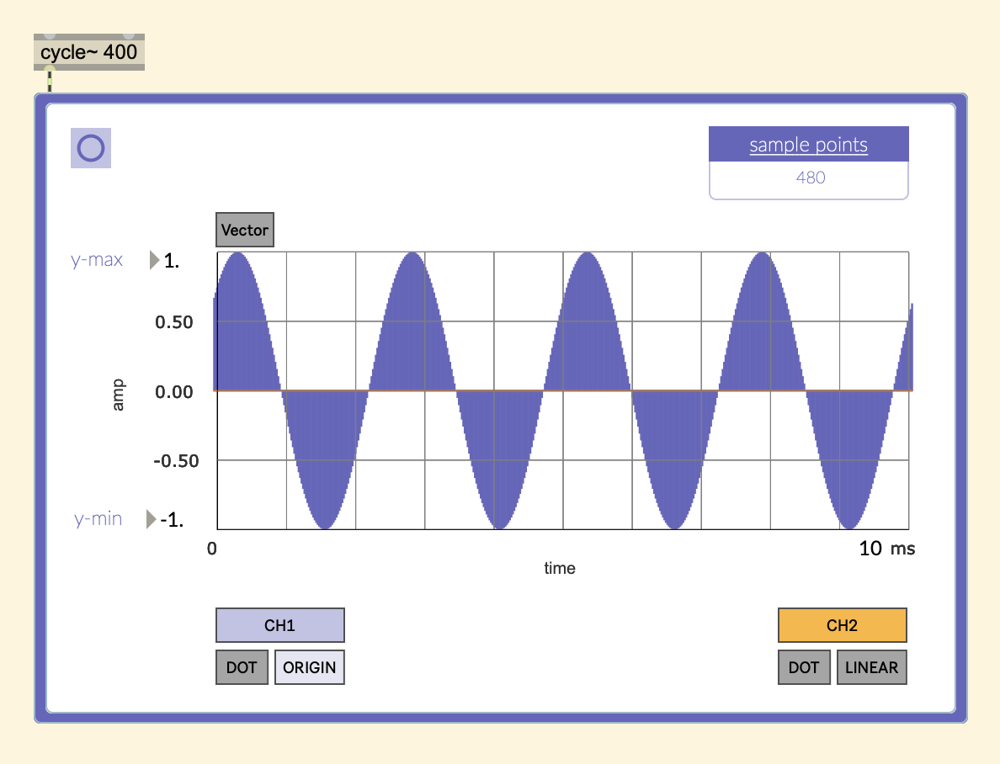

# Max Signal Plotter

## UPDATE:

This tool now has new features:

- 4 Channels
- 3 Different Modes: Sample Window Capture, Buffers, and Live Audio
- Inspecting a single point in a 44 window capture and seeing them in a cell block.

This works similarly to SuperCollider's .poll() function which polls a signal sample by sample after it is called.

You can use this to analyze a snapshot of a signal.

You can:
  - Specify the amount of milliseconds that you want to plot.
  - Specify the y-axis values.
  - Compare two channels.
  - Change the line and point type of the plot~ object.
  - Show signal vector borders.

